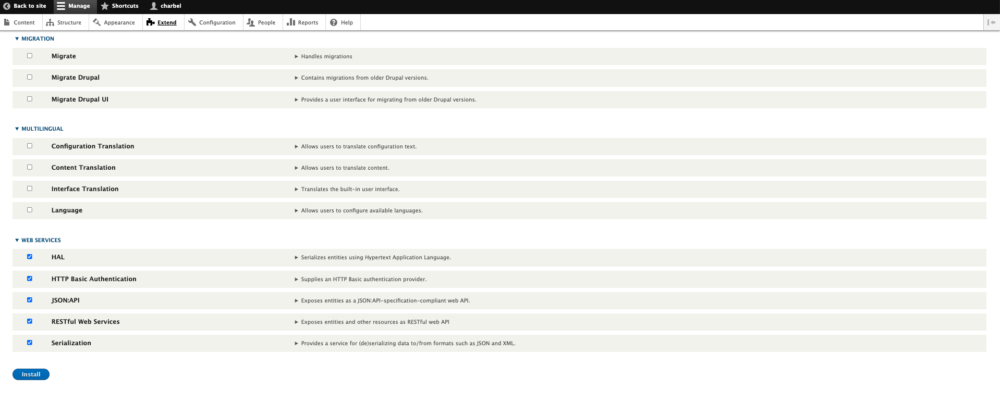
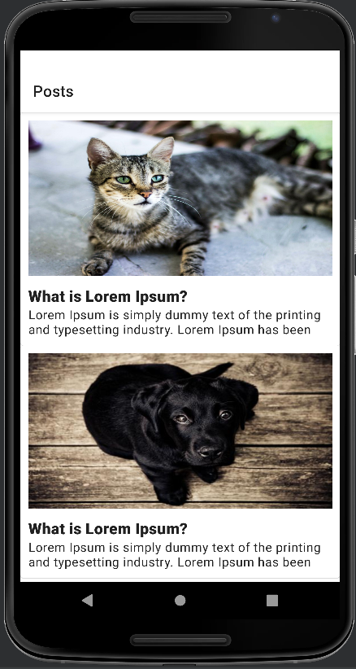
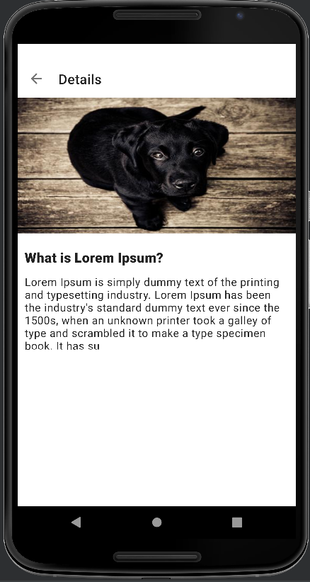

# Content Management System Client (Android)

The Content Management System Client is a sample Android application that demonstrate how to fetch content from any CMS.
In this demo we choose Drupal 9 as our CMS. the demo application perform http call to fetch list of Post Objects which is a Custom Content Type created in drupal.
 
 
# Setup Environment
To run the demo application it needs to be connected to drupal environment. 
you can either install Drupal on you local machine or connect to existing hosted environment. 
Please check [Drupal Official Documentation] in order in install it on your local machine
Make sure that you change the `API_URL` in the [gradle.properties](gradle.properties) to connect to Drupal.
 
`PS:`if you're using <b>emulator</b> and <b>local machine installation</b> do not change `API_URL`. 

## Creating Custom Content Type (Post Model)
Once Drupal installation is ready we need to create out custom content type.  
Please check [here](documentation/CustomContentType.md) how to create Custom Content Type in our case it is Post Model

## Exposing RestFull Api
By default Drupal does not have Rest Web service  plugin installed by default.
in order to fetch the previously created content we need to install some Drupal Plugin
Go to Extend and select Hal,HTTP Basic Authentication,JSON:API,	RESTful Web Services and Serialization and click install
 

  

 

## Launch the app from Android Studio
Once all the above are done you can launch the App from Android Studio 
 

  
    

 

[Drupal Official Documentation]:https://www.drupal.org/docs/installing-drupal

