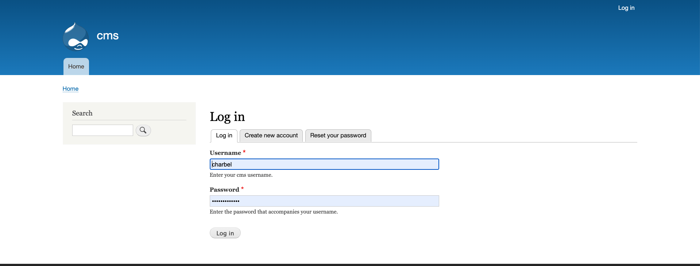
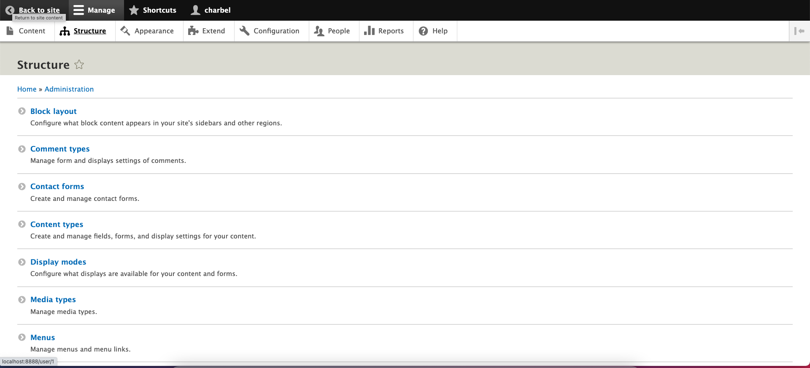
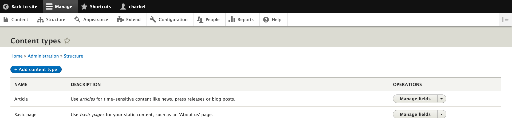
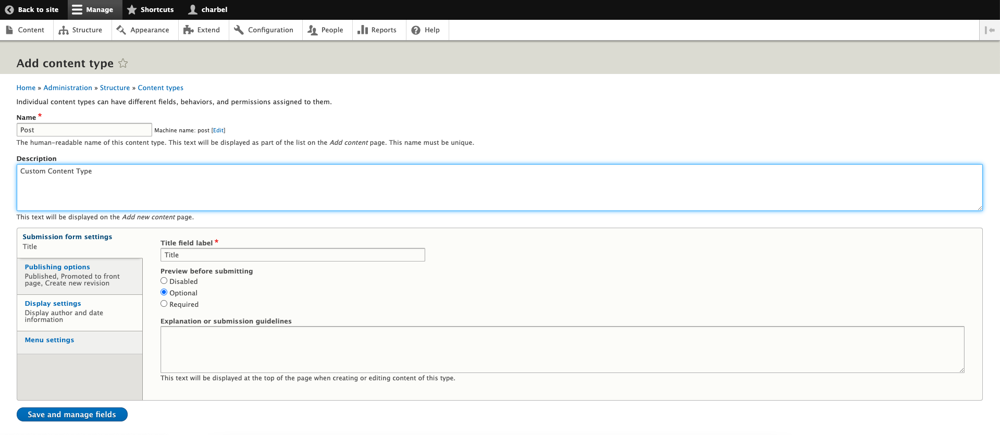
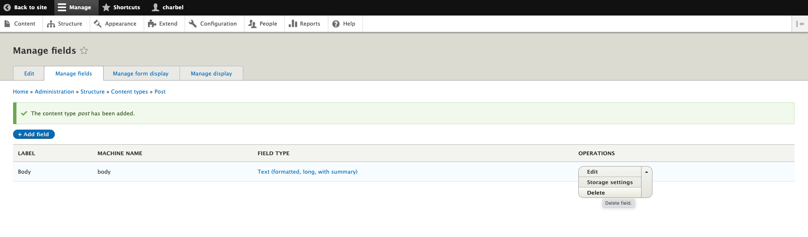
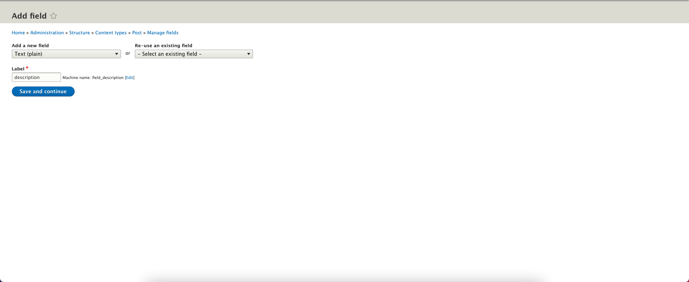
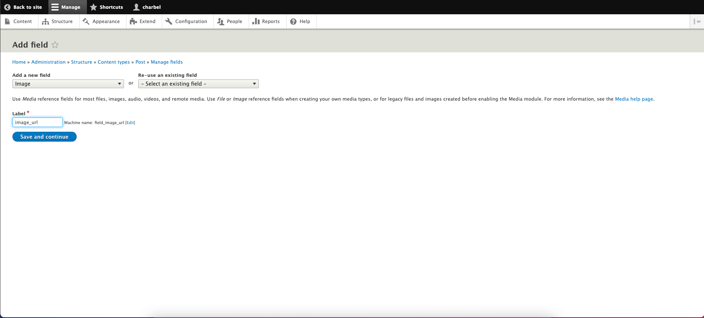
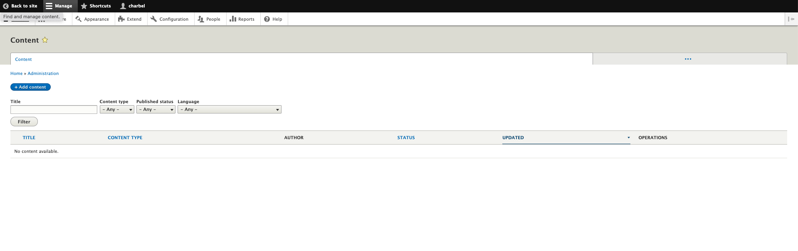

# Creating Custom Content Type (Post Model)
Once Drupal is successfully installed navigate from your favorite web browser to
[http://localhost:8888][1]
1. login using credentials created on the first startup
   
  

    
  

   
2. Go to structure and click on Content Type
   
  

    
  

   
3. Click on Add content type
   
  

    
  

   
4. In name field write Post (do not edit machine name) and save
   
  

    
  

   
5. In name field write Post (do not edit machine name) then save and manage fields
   
  

    
  

   
6. delete Body field since we don't need it in our demo
   
  

    
  

   
7. click on add field
   
  

    
  

   
8. click on add field select plain text in the Label write description (make sure not to change fields name since the are mapped in the demo app) and then click on save fields settings
   
  

    
  

   
 9. now add the image field as type  image and in the label write image_url (make sure not to change fields name since the are mapped in the demo app) and then click on save fields settings
   
  

    
  

   
  10. once you're finished you can now add content into drupal by clicking on add Content it will redirect to a different page then select Post
   
  

    
  

   
 
 

[1]: http://localhost:8888